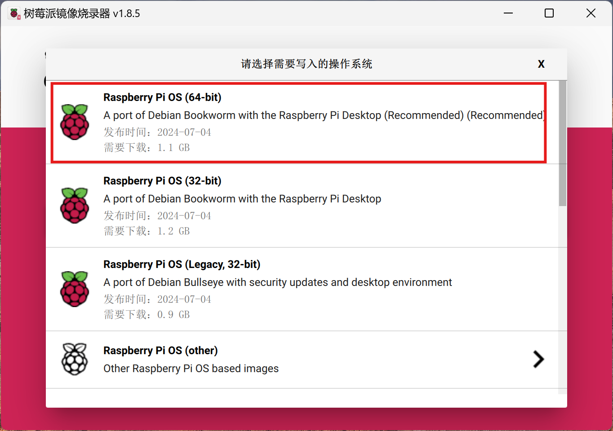
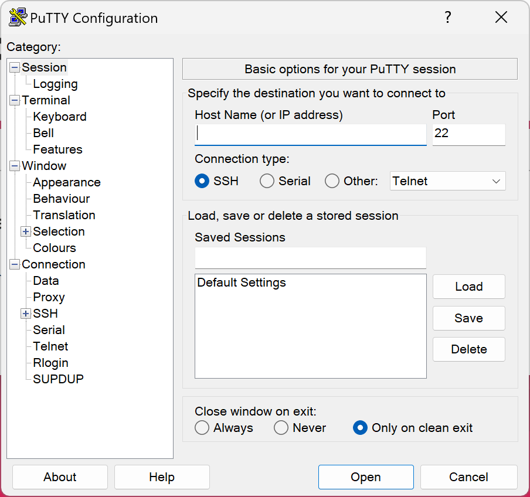

# 树莓派4b系统搭建
## 准备工作
- 硬件
  - 树莓派4b
  - USB-C电源（5V 3A）
  - SD卡（最好大于16G）+读卡器
  - 笔记本电脑(联网+热点)
  - miniHDMI转HDMI, HDMI显示器，鼠标，键盘
- 软件
  - 树莓派系统Image
  - RealVNC viewer
  - Putty
  - WinSCP
## 系统搭建
- 软件
  - Imager镜像烧录软件下载[https://www.raspberrypi.com/software]
    - []
    - 下载完成后NEXT安装完成
  - Imager制作
    - 将SD卡连接到PC，确保正常连接。
    - 打开镜像烧录软件 []
    - 点击CHOOSE DEVICE按钮 选择 Raspberry Pi 4[]
    - 点击选择操作系统选择Raspberry Pi OS(64-bit)[]
    - 点击选择SD卡[]
    - 点击NEXT弹出设置框[]
    - 点击编辑设置进行相关设置
    - GENERAL设置[]
      - 设置主机名：raspberrypi
      - 设置树莓派的用户名和密码
      - **设置配置现有的WIF名称和密码，用于树莓派系统自动联网**
      - WIFI国家选择CN
      - 语言选择shanghai
    - SERVICES设置[]
      - 勾选上开启SSH服务(**用于首次SSH连接**) 
    - 点击保存
    - 返回设置框，选择‘是’，会提示警告框，再一次选择‘是’[]
    - 烧录器会下载并写入Image[]
    - 烧录完成后系统弹框[]
  - Putty软件下载安装
    - 用于WinPC通过SSH连接树莓派
    - 地址[https://www.chiark.greenend.org.uk/~sgtatham/putty/latest.html]
    - 下载对应系统版本安装完成后[]
  - RealVnc软件下载安装
    - 用于VNC方式连接树莓派
    - 地址[https://www.realvnc.com/en/connect/download/viewer/#]
    - 根据系统选择对应的RealVNC Viewer[]
    - 安装完成后[]
  - WinSCP软件下载安装
    - 用于FTP文件传输
    - 地址[https://winscp.net/eng/index.php]
    - 安装完成后[]
- 硬件
  - 连接miniHDMI 和显示器的HDMI，连接鼠标键盘到树莓派USB2.0接口
  - 将烧录好Image的SD卡插入树莓派SD卡槽
  - 将USB-C电源连接到树莓派