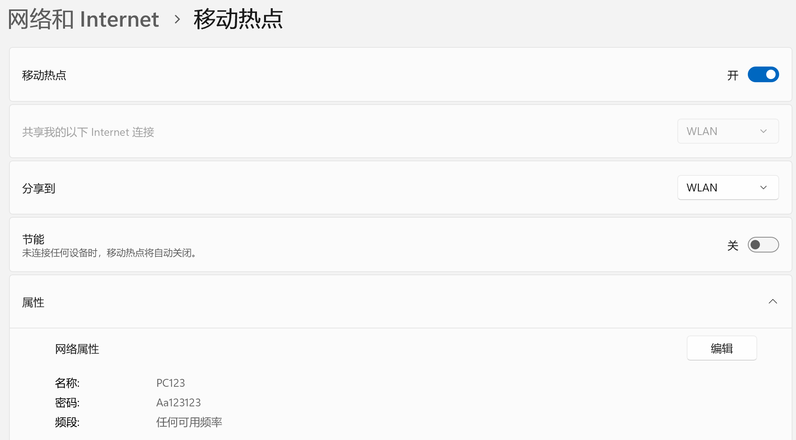
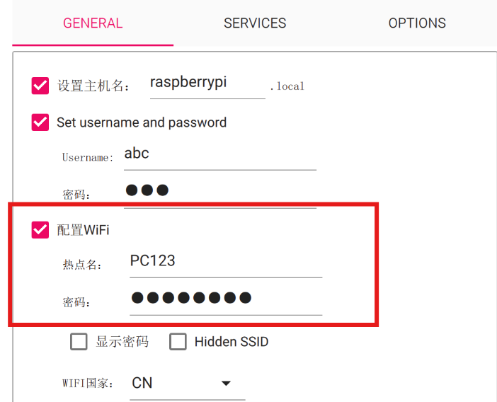
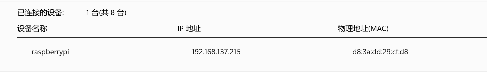
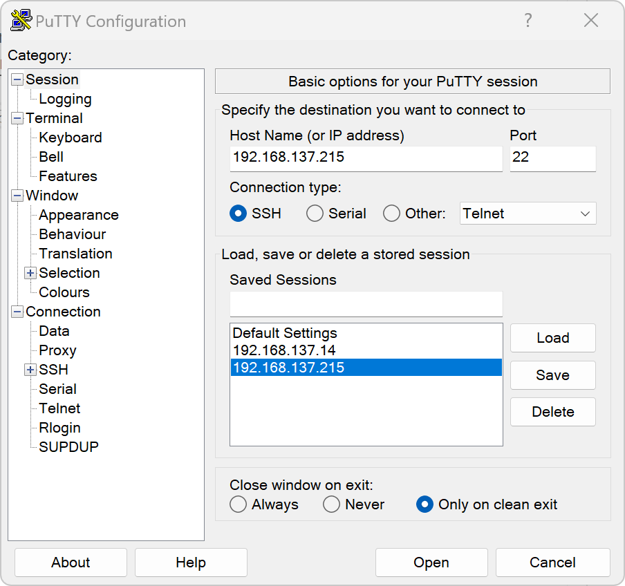
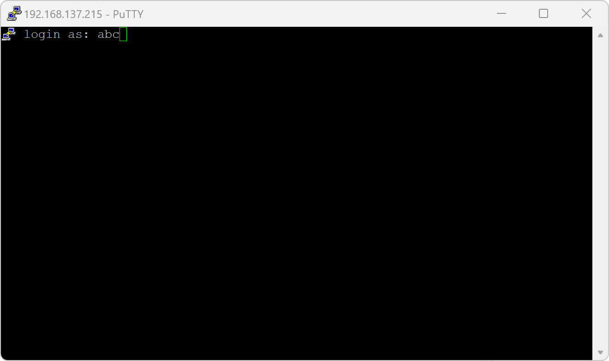
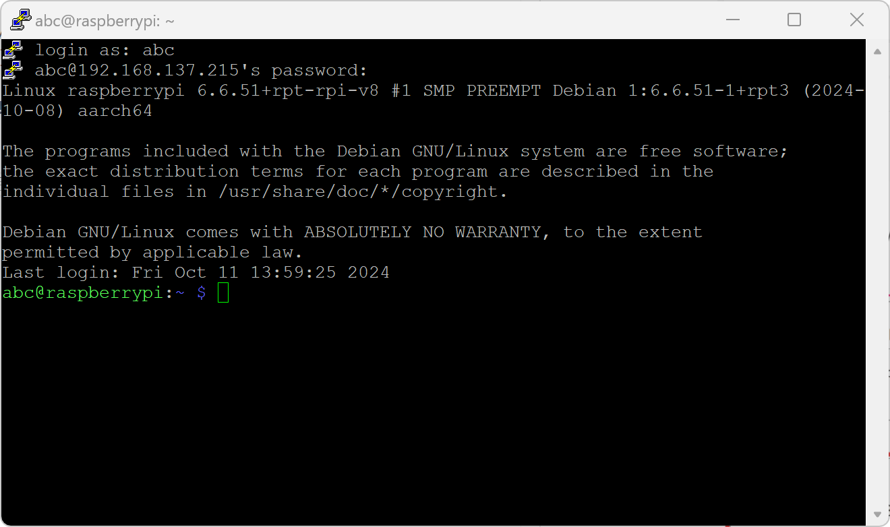
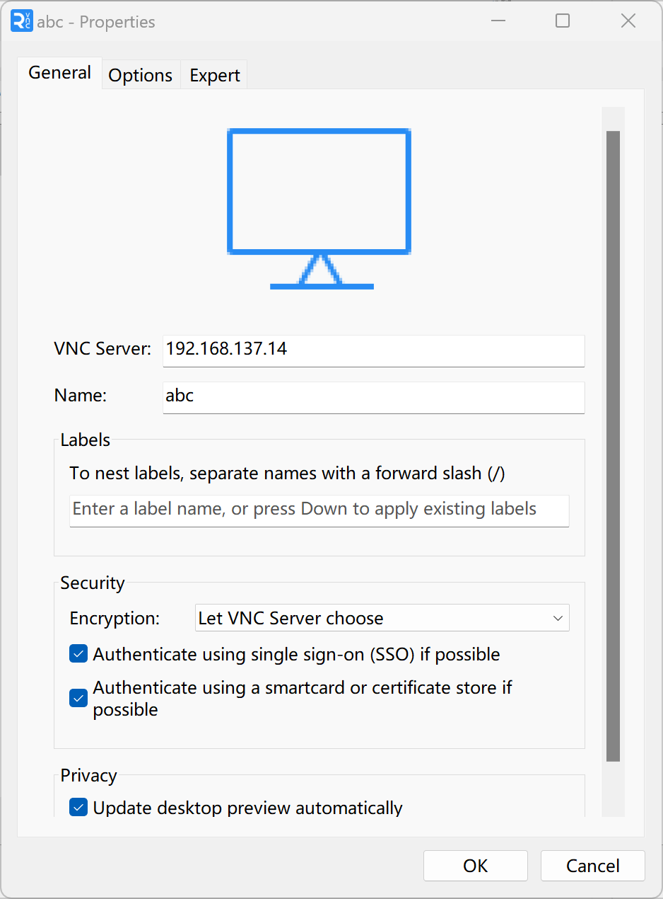
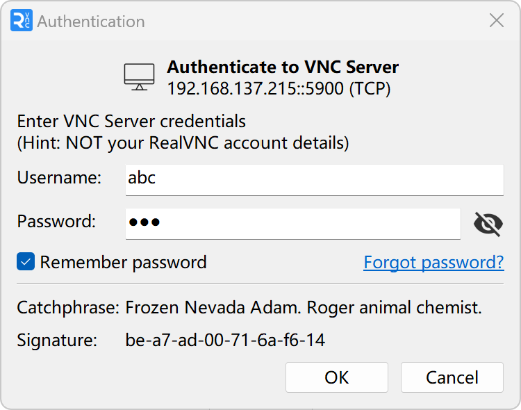
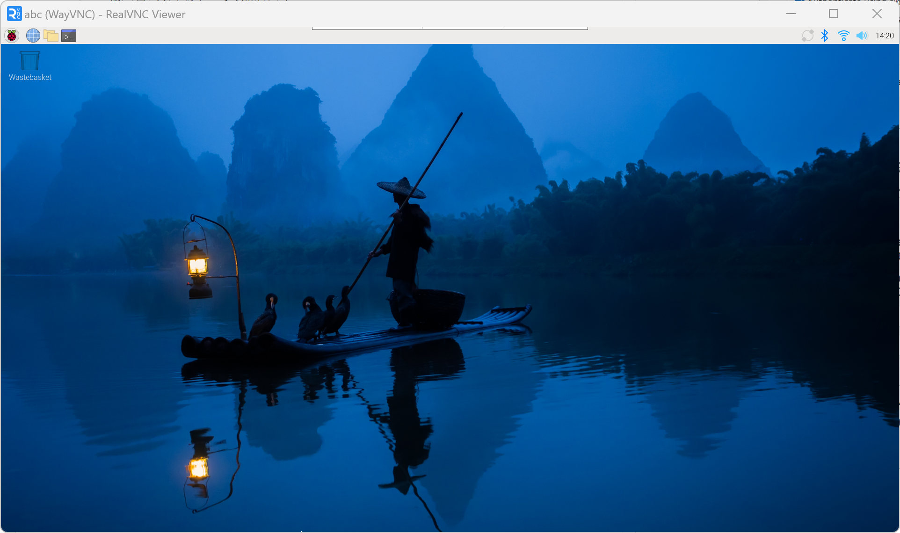

# 系统启动
## 有显示器启动
    - 连接miniHDMI 和显示器的HDMI，连接鼠标键盘到树莓派USB2.0接口
    - 将烧录好Image的SD卡插入树莓派SD卡槽
    - 将USB-C电源连接到树莓派
    - 系统将自行启动
## 无显示器启动
- 事前准备
  - 准备一台能够开启移动热点的PC
  - 开启PC的移动热点[]
  - 写入Image时设置的WIFi为PC的移动热点[]
  - 将烧录好Image的SD卡插入树莓派SD卡槽
  - 将USB-C电源连接到树莓派
- 启动
  - 打开PC的网络和Internet/移动热点界面查看连接到此热点的树莓派ip[]
  - SSH连接
    - 打开Putty，输入IP连接[]
    - 点击OPEN
    - 输入用户名：abc然后回车[]
    - 输入密码(终端不显示)然后回车
    - 登录成功会显示用户名@树莓派名：~ $[]
  - 打开VNC配置
    - sudo raspi-config
    - 选择interface，打开VNC server
  - 通过vnc连接树莓派
    - 打开RealVNC viewver软件
    - 选择File-New connect[]
    - 输入IP地址和树莓派名完成新建连接
    - 点击新键连接图标，输入用户名密码[]
    - 成功登录[]