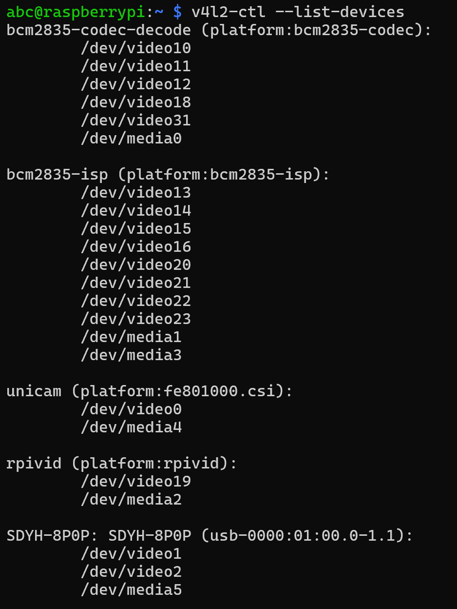
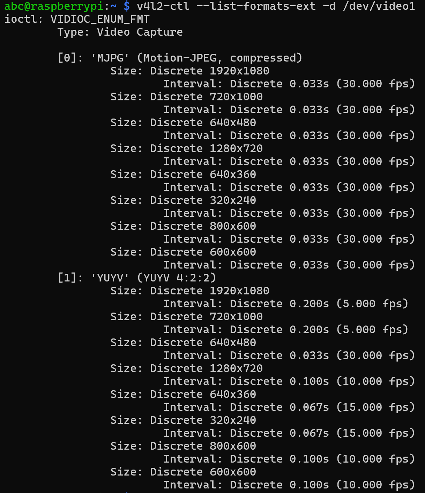

# 使用USB摄像头
## fswebcam拍照
- 确认USB摄像头的设备节点
  - v4l2-ctl --list-devices
  - 
- 查看摄像头支持的格式与分辨率
  - v4l2-ctl --list-formats-ext -d /dev/video1
  - 

- 安装fswebcam 软件包
  - sudo apt install fswebcam
- 将用户名添加到video 组
  - sudo usermod -a -G video abc
  - sudo reboot  重启树莓派
  - groups abc 确认包含video
- 拍照
  - 默认分辨率320x240
    - fswebcam Desktop/images/uvc.jpg --device /dev/video1
  - 改变分辨率1280x720
    - fswebcam -r 1280x720 Desktop/images/uvc.jpg --device /dev/video1
  - 改变分辨率1920x1080
    - fswebcam -r 1920x1080 Desktop/images/uvc.jpg --device /dev/video1
  - 移除横幅
    - fswebcam --no-banner -r 1920x1080 Desktop/images/uvc.jpg --device /dev/video1 
  - 时间命名
    - sudo nano webcam.sh
    - 输入如下指令
        ```
        #!/bin/bash


        DATE=$(date +"%Y-%m-%d_%H-%M-%S")

        fswebcam --no-banner -r 1920x1080 Desktop/images/$DATE.jpg --device /dev/video1
        ```
    - ctrl + S保存 ctrl + X退出
    - bash webcam.sh
  ## Motion进行视频监控
  - 安装motion
    - sudo apt-get install motion
  - 配置motion
    - sudo nano /etc/motion/motion.conf
      - daemon on 设置
    - sudo motion 开启
    - sudo killall motion 关闭
    - sudo tail -n 50 /var/log/motion/motion.log 查看log
    - ps aux | grep motion 查看进程
  - 访问视频流
    - 192.168.137.215:8081